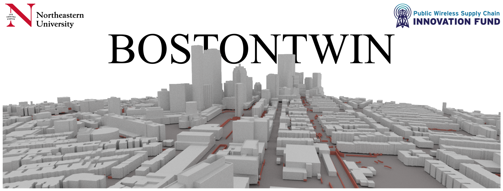
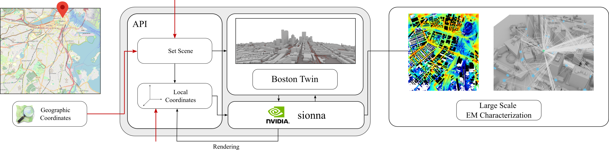
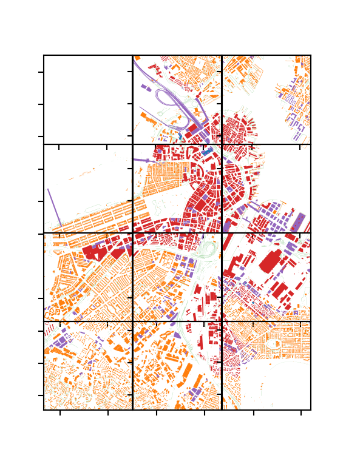
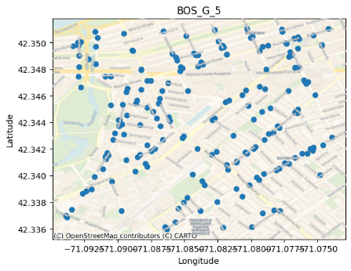

# BostonTwin
Repository for the BostonTwin dataset API.

## Requirements
The basic requirements for the BostonTwin API are based on those of [Sionna](<https://nvlabs.github.io/sionna/>), plus some georeferencing libraries:
1. `python>=3.8`
2. `geopandas`
3. `open3d`
4. `contextily`

and the corresponding dependencies.

We provide a requirement file for pip (`requirements.txt`) and conda (`environment.yaml`) to create a Python virtual environment with all the dependencies.
Additionally, we provide a DOCKERFILE to generate a container with all the required libraries. This is the preferred method.

## Quickstart
1. Clone this repo
2. Download the BostonTwin dataset from <https://repository.library.northeastern.edu/files/neu:h989t1201> into the `bostontwin` folder.
3. Install the requirements. We suggest using the provided DOCKERFILE:
    a. From the boston_twin directory, run `docker build -t bostontwin -f DOCKERFILE .`
    b. Run the container binding the boston_twin directory to the container:
    `docker run --privileged=true --gpus=all --mount type=bind,src=".",target="/home/root/boston_twin" --env NVIDIA_DRIVER_CAPABILITIES=graphics,compute,utility --rm -it bostontwin`
4. Run the [bostontwin_demo](<https://github.com/wineslab/boston_twin/blob/main/bostontwin_demo.ipynb>) Jupyter Notebook to see how to use BostonTwin, the Digital Twin of Boston!
5. Refer to the [documentation](<https://wineslab.github.io/boston_twin/src/classes/BostonTwin.html>) for additional information.

## Workflow



BostonTwin contains the 3D models of the structures [1] and of the antennas [2] in Boston, MA, and relies on [Sionna](<https://nvlabs.github.io/sionna/>) to provide a realistic characterization of the propagation of the electromagnetic signal in the area.

The API offers geo-referencing tools to interact with and manipulate the digital twin. Please refer to the `bostontwin_demo` Jupyter Notebook to see how to use BostonTwin.

[//]: # "## Documentation"
[//]: # "Please refer to the Jupyter Notebook"

## Data
### 3D Boston Model

The 3D models of BostonTwin are derived from [1] and can be downloaded from <http://hdl.handle.net/2047/D20623157>. The 3D information for each model is encoded in a PLY file in the `meshes` folder. The 2D footprint and other information are also available in the GeoJSON of the corresponding tile. For instance, each model has a level of detail (LOD) of the 3D model, encoded according to the [CitySchema documentation](<https://www.cityschema.org/data_dictionary/index.htm#LOD>). In the above figure, we report a visualization of the LOD of the current models for the central area of Boston.

### Antenna Location
<p float="left">
  
   
</p>

Besides the 3D models of the buildings in Boston, BostonTwin contains the geo-referenced location of the real wireless antenna throughout the city, according to [2]. That can be used to study, analyze and design optimization problems and solutions in a real world setting, having realistic data to start from.

## Citation
If you use BostonTwin in a scientific work, please cite it as:
```
Paolo Testolina, Michele Polese, Pedram Johari, and Tommaso Melodia. 2024. Boston Twin: the Boston Digital Twin for Ray-Tracing in 6G Networks. In Proceedings of the 15th ACM Multimedia Systems Conference (MMSys '24). Association for Computing Machinery, New York, NY, USA, 441–447. https://doi.org/10.1145/3625468.3652190
```
BibTeX:
```bibtex
@inproceedings{10.1145/3625468.3652190,
author = {Testolina, Paolo and Polese, Michele and Johari, Pedram and Melodia, Tommaso},
title = {Boston Twin: the Boston Digital Twin for Ray-Tracing in 6G Networks},
year = {2024},
isbn = {9798400704123},
publisher = {Association for Computing Machinery},
address = {New York, NY, USA},
url = {https://doi.org/10.1145/3625468.3652190},
doi = {10.1145/3625468.3652190},
pages = {441–447},
numpages = {7},
keywords = {Digital Twin, Ray Tracing, Wireless Networks},
location = {<conf-loc>, <city>Bari</city>, <country>Italy</country>, </conf-loc>},
series = {MMSys '24}
}
```

## Credits
[1] The 3D models of the structures in Boston are published by the Boston Planning and Development Agency (BPDA) [<https://www.bostonplans.org/3d-data-maps/3d-smart-model>].\
[2] The antenna location was obtained from the City of Boston's Open Data hub [<https://data.boston.gov/>].

## Acknowledgments
This work was partially supported by the National Telecommunications and Information Administration (NTIA)’s Public Wireless Supply Chain Innovation Fund (PWSCIF) under Award No. 25-60-IF011.
